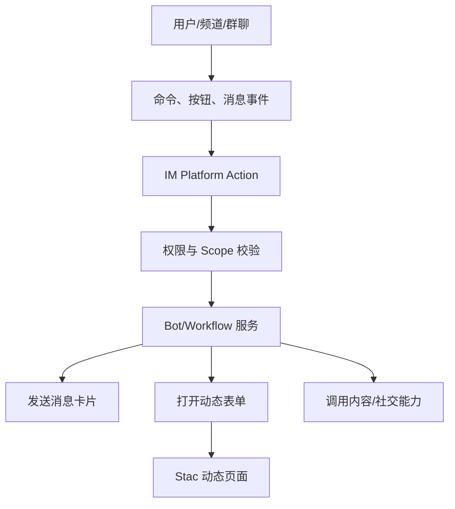

# IM 动态能力开放规划

## 1. 目标

在社交客户端中增加类似 Slack/Discord 的 IM 扩展能力，但不开放任意代码执行。平台提供固定、安全、可审计的 IM 核心能力，用户通过配置、命令、消息卡片、表单和工作流构建自己的功能。

当前实现目标是 POC：

- 模拟会话列表。
- 模拟频道、群聊、Bot。
- 模拟 slash command。
- 模拟动态消息卡片。
- 点击卡片打开 Stac 动态表单。
- 表单提交后调用平台 action。

## 2. 参考 Slack/Discord 的方式

### Slack 方向

Slack 的核心思路是：

- App 安装到 workspace 或 channel。
- App 通过 scopes 获得权限。
- 使用 Block Kit 描述消息和交互 UI。
- 用户点击按钮、选择菜单、提交 Modal 后触发服务端交互。
- App 可以发送消息，但受权限、频道和用户授权限制。

对我们的启发：

- 消息 UI 应该结构化配置，而不是任意代码。
- 交互入口包括按钮、表单、命令和事件。
- 权限必须是 scope 化的。
- App 安装位置应区分全局、频道、群聊和单聊。

### Discord 方向

Discord 的核心思路是：

- Application Command 作为主要入口。
- Slash command、用户菜单、消息菜单触发应用能力。
- Components 和 Modal 由客户端原生渲染。
- Bot 在 guild/channel 中工作，权限非常明确。

对我们的启发：

- 命令是非常适合 IM 场景的低成本动态能力入口。
- Message Component 可以承载任务、审批、投票、报名等业务。
- Modal 适合收集表单数据。
- Bot 应该作为“能力代理”，而不是让第三方直接操作 IM。

## 3. 平台能力分层

### 固定 IM 核心能力

这些能力由公司客户端和服务端固定实现：

- 会话列表。
- 单聊、群聊、频道。
- 文本消息。
- 卡片消息。
- 系统消息。
- 已读、未读、撤回、举报。
- 成员管理。
- 消息推送。
- 安全审计。

### 动态能力层

这些能力可以开放给用户配置：

- slash command。
- 消息卡片模板。
- Bot 欢迎语。
- 群工具页。
- 频道公告页。
- 动态表单 Modal。
- 点击按钮触发工作流。
- 表单提交后发送卡片。

### 权限控制层

所有能力都需要 scope：

- `chat.open`
- `channel.read`
- `message.send_card`
- `message.reply`
- `modal.open`
- `command.register`
- `workflow.start`
- `member.invite`

## 4. 当前 POC 已实现

新增入口：

- `IM`

新增代码：

- `lib/src/im/im_models.dart`
- `lib/src/im/mock_im_repository.dart`
- `lib/src/im/im_demo_page.dart`
- `assets/stac/im/campaign_form.json`

已模拟能力：

- 会话列表。
- 频道、Bot、群聊。
- 消息列表。
- 文本消息。
- 系统消息。
- 动态消息卡片。
- `/campaign` 命令生成活动卡片。
- `/poll` 命令生成投票卡片。
- 点击卡片打开动态 Stac 表单。
- 分享卡片。
- 表单提交走平台 action。

## 5. 可以开放给用户的 IM 功能

### 群/频道工具

用户可以配置：

- 群公告。
- 入群欢迎页。
- 频道工具页。
- 常用链接。
- 活动入口。
- Bot 使用说明。

### 消息卡片

用户可以配置：

- 活动卡片。
- 文章卡片。
- 投票卡片。
- 报名卡片。
- 审批卡片。
- 任务卡片。
- 客服卡片。

### 命令

用户可以配置：

- `/campaign` 创建活动。
- `/poll` 发起投票。
- `/task` 创建任务。
- `/feedback` 提交反馈。
- `/request_scope` 申请能力。

### 工作流

用户可以配置：

- 用户点击按钮后打开表单。
- 表单提交后发送卡片。
- 新成员加入后发送欢迎消息。
- 定时发送提醒。
- 内容发布后同步到频道。
- 用户报名后通知管理员。

## 6. 不应开放的 IM 能力

不建议开放：

- 静默发送私信。
- 批量群发。
- 批量拉群。
- 任意读取聊天记录。
- 读取用户通讯录。
- 读取非公开关系链。
- 绕过用户确认发送消息。
- 动态执行 Dart 或 Native 代码。

## 7. 产品化阶段

### 阶段 1：本地 POC

目标：

- 展示 IM 动态能力体验。
- 证明命令、卡片、表单、Action 能串起来。

状态：

- 已完成基础实现。

### 阶段 2：动态卡片协议

目标：

- 设计 `message_card` 协议。
- 支持卡片版本、按钮、状态、权限。
- 支持 Stac 渲染复杂卡片或详情页。

### 阶段 3：Bot 与命令注册

目标：

- App 可以注册命令。
- 命令绑定 scope。
- 用户在频道输入命令后触发 Bot。
- Bot 返回卡片或打开表单。

### 阶段 4：服务端工作流

目标：

- 支持事件触发。
- 支持表单提交。
- 支持消息发送。
- 支持条件判断和状态流转。

### 阶段 5：开放平台

目标：

- 应用安装到群/频道。
- 第三方申请 scope。
- 管理员审批。
- 审核消息模板。
- 数据看板和风控。

## 8. 下一步建议

短期可以继续补：

- 卡片配置查看器。
- App Manifest 示例。
- `/request_scope` 的授权弹窗。
- 表单提交后真正插入一条新卡片消息。
- Bot 应用安装管理页。

中期再接：

- WebSocket/IM SDK。
- 后台命令注册接口。
- 服务端工作流引擎。
- 审核与风控。
