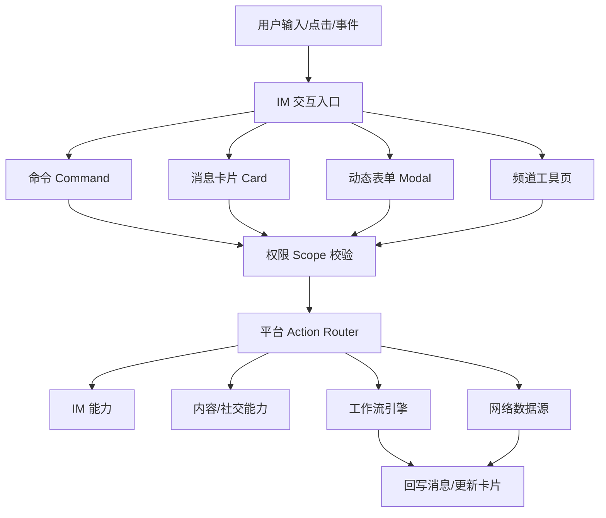
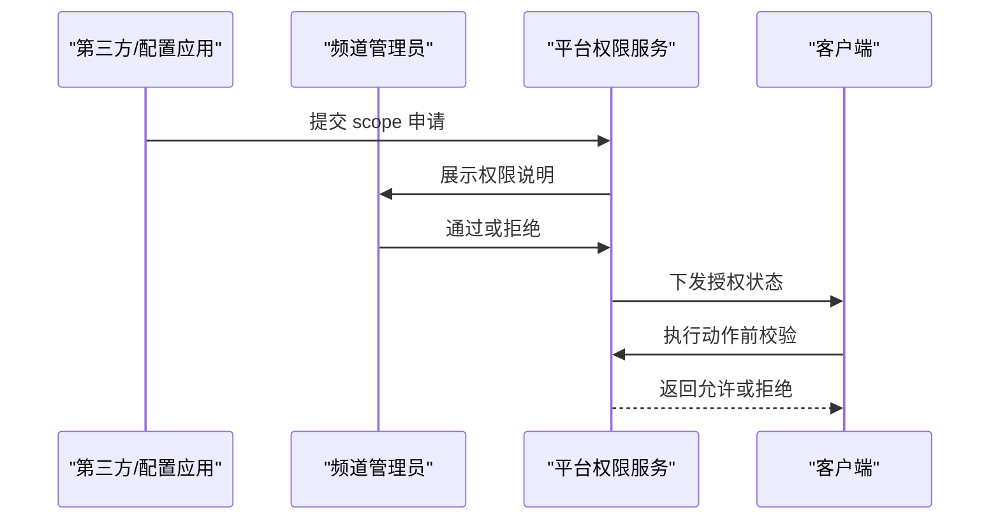
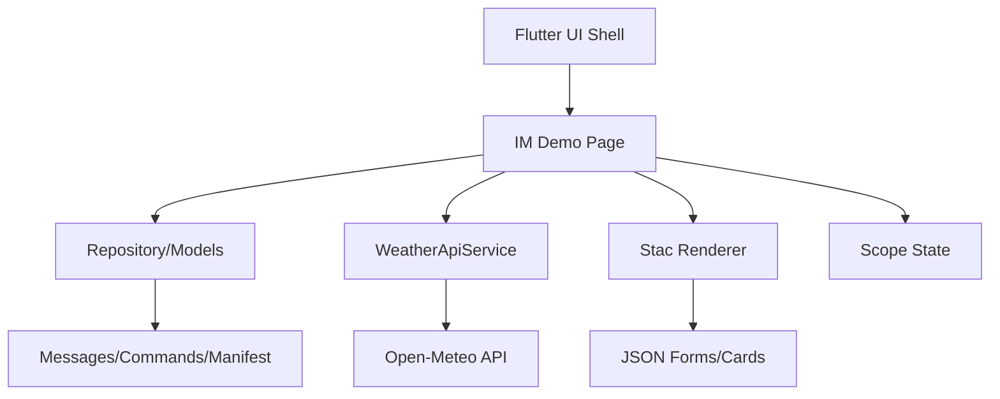
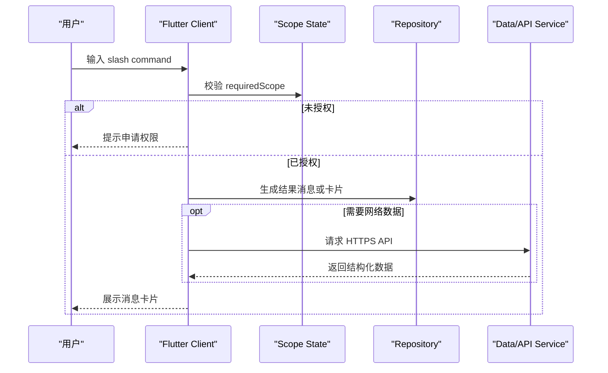

# IM 动态能力平台完整设计方案

## 1. 方案目标

QuickUI 的 IM 动态能力平台目标是：在社交媒体客户端内，把即时通讯、内容、社交、表单、工作流和外部数据源能力封装成安全、可配置、可审核的平台能力，让内部运营、合作方或未来第三方用户可以通过配置快速构建频道工具、消息卡片、Bot 命令和业务流程。

核心边界：

- 不开放任意 Dart、Native、dex、so 或脚本执行。
- 第三方只能声明 UI、数据源、交互动作和所需权限。
- 客户端和平台服务端负责权限校验、能力执行、审计、风控和兜底。
- IM 核心链路必须由公司控制，动态能力只能在受控范围内扩展。

## 2. 产品定位

这个平台可以理解为“社交客户端里的轻应用和 Bot 平台”。

它面向三类使用者：

- 内部运营：配置活动频道、内容分发、创作者任务、客服入口。
- 业务团队：配置审批、报名、问卷、数据看板、提醒工作流。
- 外部合作方：配置品牌活动、粉丝社群工具、内容推广卡片。

参考对象：

- Slack：App、Scope、Block Kit、Modal、Workflow。
- Discord：Slash Command、Bot、Message Component、Modal、Guild/Channel 权限。
- 企业微信/飞书：机器人、群应用、审批、表单、消息卡片。

## 3. 核心能力地图



## 4. 可开放功能设计

### 4.1 会话和频道能力

可开放：

- 打开单聊、群聊、频道。
- 在频道内安装应用。
- 展示频道工具页。
- 发送受审核的卡片消息。
- 通过用户确认后邀请成员。
- 查看当前应用在频道内的授权范围。

不开放：

- 任意读取聊天记录。
- 静默私信用户。
- 静默拉群或批量邀请。
- 绕过用户确认发送营销消息。

### 4.2 Bot 和命令能力

命令是 IM 动态能力最稳定的入口。

命令示例：

- `/campaign`：创建活动卡片。
- `/poll`：发起投票。
- `/weather Shanghai`：调用天气 API 并发送天气卡片。
- `/workflow`：启动活动发布工作流。
- `/invite 张三 李四`：邀请成员加入频道。
- `/request_scope`：申请更多能力。

命令配置需要包含：

- `name`：命令名。
- `description`：说明。
- `requiredScopes`：需要的权限。
- `parameters`：参数定义。
- `handler`：绑定的平台能力或工作流。
- `response`：返回文本、卡片或表单。

### 4.3 消息卡片能力

消息卡片用于承载结构化业务结果，不是普通富文本。

可配置卡片类型：

- 活动卡片。
- 投票卡片。
- 文章分享卡片。
- 天气数据卡片。
- 工作流状态卡片。
- 报名卡片。
- 审批卡片。
- 任务卡片。
- 客服卡片。

卡片协议建议包含：

- `schemaVersion`：协议版本。
- `template`：模板 ID。
- `requiredScopes`：权限声明。
- `dataSource`：可选数据源。
- `mapping`：数据到 UI 的字段映射。
- `layout`：UI 结构。
- `actions`：按钮动作。
- `fallback`：低版本或失败兜底。

### 4.4 动态表单和 Modal

适用场景：

- 活动报名。
- 投票创建。
- 反馈收集。
- 审批提交。
- 任务创建。
- 权限申请。

表单配置需要支持：

- 输入框、选择器、日期、开关、上传入口。
- 必填、长度、格式、范围校验。
- 提交前权限校验。
- 提交后触发工作流。
- 成功后回写消息或更新卡片。

### 4.5 工作流能力

工作流用于把多个平台能力串起来。

示例：活动发布工作流

1. 用户输入 `/workflow`。
2. 客户端检查 `workflow.start`。
3. 平台启动工作流。
4. 校验活动信息。
5. 通知频道管理员。
6. 生成审核待办。
7. 回写工作流状态卡片。

工作流节点类型：

- `rule_check`：规则校验。
- `message.send_card`：发送卡片。
- `message.update_card`：更新卡片状态。
- `task.create`：创建任务。
- `network.request`：调用外部数据源。
- `approval.request`：发起审批。
- `delay`：延迟执行。
- `condition`：条件分支。

### 4.6 成员邀请能力

成员邀请应该是受控能力。

设计原则：

- 需要 `member.invite` scope。
- 邀请动作必须有用户可见反馈。
- 真实产品中应支持管理员限制、频控和审计。
- 第三方只能发起邀请请求，不能绕过平台直接修改群成员。

当前 Demo：

- 未授权时输入 `/invite 张三 李四` 会提示缺少权限。
- 通过 `/request_scope` 默认授权后，再次输入会模拟邀请成功。

### 4.7 网络 API 数据源能力

网络 API 能力用于把外部数据转成卡片或页面。

当前 Demo 使用 Open-Meteo：

- 无需 API key。
- HTTPS GET。
- JSON 返回。
- `/weather Shanghai` 触发查询。
- 点击“刷新天气”随机切换中国城市并重新请求。

生产协议建议：

- 只允许 HTTPS。
- 初期只开放 GET。
- 请求域名需要后台白名单。
- 密钥不下发客户端，由平台服务端代理。
- 支持缓存、超时、重试、失败兜底。
- 数据映射使用声明式 mapping，不允许执行脚本。

## 5. 权限和治理设计

### 5.1 Scope 模型

建议按能力定义 scope：

- `message.send_card`：发送卡片消息。
- `message.reply`：回复消息。
- `modal.open`：打开动态表单。
- `command.register`：注册命令。
- `workflow.start`：启动工作流。
- `member.invite`：邀请成员。
- `network.request`：调用受控网络数据源。
- `content.read`：读取公开内容。
- `content.share`：分享内容。
- `channel.read`：读取频道基础信息。

### 5.2 授权流程



当前 Demo 为了演示效率，`/request_scope` 提交后默认通过。真实环境必须进入审批、审计和撤销流程。

### 5.3 风控规则

必须具备：

- 应用级调用频控。
- 用户级操作频控。
- 卡片模板审核。
- 敏感词和营销检测。
- 第三方接口域名白名单。
- 失败率监控和自动熔断。
- 操作审计日志。

## 6. 技术实现方案

### 6.1 客户端分层



当前代码：

- `lib/src/im/im_models.dart`：IM 数据模型。
- `lib/src/im/mock_im_repository.dart`：模拟会话、消息、命令、Manifest、卡片生成。
- `lib/src/im/im_demo_page.dart`：IM 页面、命令处理、权限状态、卡片交互。
- `lib/src/im/weather_api_service.dart`：天气 API 请求和 JSON 解析。
- `assets/stac/im/*.json`：卡片和表单配置。

### 6.2 数据模型

核心模型：

- `ImConversation`：会话。
- `ImMessage`：消息。
- `ImCard`：消息卡片。
- `ImCommand`：命令。
- `ImAppManifest`：应用 Manifest。
- `ImScope`：权限。
- `ImCardTemplate`：卡片模板。

生产环境需要补充：

- `ImAppInstallation`：应用安装位置。
- `ImActionEvent`：按钮、命令、表单提交事件。
- `ImWorkflowRun`：工作流运行实例。
- `ImDataSource`：外部数据源定义。
- `AuditLog`：审计日志。

### 6.3 命令执行流程



### 6.4 Stac 和动态配置

当前 Demo 中，Stac 用于动态表单和配置展示。消息卡片暂时是 Flutter 原生容器读取 `ImCard` 渲染，卡片模板 JSON 用于表达协议和后续演进方向。

建议演进：

1. 当前阶段：原生卡片 + JSON 协议说明。
2. 下一阶段：卡片 body 使用 Stac 片段渲染。
3. 再下一阶段：后台下发 Manifest、Command、CardTemplate、DataSource。
4. 产品化阶段：配置签名、schema 校验、灰度、回滚、审核。

### 6.5 网络 API 接入

客户端 Demo：

- 使用 `http`。
- 使用 `Uri.https` 构建请求。
- 检查 HTTP status code。
- `jsonDecode` 后映射为强类型模型。
- Android 增加 `INTERNET` 权限。

生产建议：

- 客户端不直接持有第三方 API key。
- 平台服务端做 API Gateway。
- Gateway 负责鉴权、签名、限流、缓存、日志和数据脱敏。
- 客户端只拿已标准化的数据模型。

### 6.6 状态管理

当前 Demo 使用 `StatefulWidget + setState` 管理局部状态，适合 POC：

- 当前会话。
- 消息列表。
- 已授权 scope。
- 输入框和滚动控制器。

产品化后建议：

- IM SDK 状态进入 Repository。
- 页面状态进入 ViewModel。
- 授权状态、应用安装状态、工作流状态统一由服务端下发。
- 使用 Provider、Riverpod 或项目既有状态管理方案做单向数据流。

## 7. 后台服务设计

生产环境建议拆分服务：

- App Registry：应用、Manifest、命令、模板注册。
- Permission Service：Scope 申请、审批、撤销。
- Config Service：动态页面和卡片配置版本管理。
- Workflow Service：工作流编排和运行状态。
- API Gateway：第三方 API 代理。
- Audit Service：审计日志。
- Risk Service：风控、频控、内容审核。
- Metrics Service：调用量、错误率、转化率。

## 8. 配置协议示例

### 8.1 Manifest

```json
{
  "appId": "quickui_creator_bot",
  "name": "QuickUI 创作者助手",
  "commands": [
    {
      "name": "/workflow",
      "description": "启动活动发布工作流",
      "requiredScopes": ["workflow.start"],
      "handler": "workflow.campaign_publish_review"
    }
  ],
  "scopes": [
    {
      "id": "workflow.start",
      "name": "启动工作流",
      "description": "允许应用启动自动化流程"
    }
  ]
}
```

### 8.2 卡片模板

```json
{
  "schemaVersion": "1.0",
  "template": "workflow_card",
  "requiredScopes": ["workflow.start", "message.send_card"],
  "layout": {
    "type": "messageCard",
    "header": {
      "title": "{{workflow.title}}",
      "subtitle": "自动化工作流"
    },
    "actions": [
      {
        "label": "推进流程",
        "actionType": "platform",
        "capability": "workflow.advance"
      }
    ]
  }
}
```

### 8.3 数据源

```json
{
  "type": "https",
  "provider": "open_meteo",
  "method": "GET",
  "endpoint": "https://api.open-meteo.com/v1/forecast",
  "auth": "none",
  "requiredScopes": ["network.request"],
  "mapping": {
    "temperature": "$.current_weather.temperature",
    "windSpeed": "$.current_weather.windspeed"
  }
}
```

## 9. 当前 Demo 使用说明

在 IM 页面可测试：

- `/campaign`：生成活动卡片。
- `/poll`：生成投票卡片。
- `/weather Shanghai`：调用天气 API 并生成天气卡片。
- 点击天气卡片“刷新天气”：随机切换中国城市并重新请求。
- `/workflow`：未授权时提示缺少 `workflow.start`。
- `/invite 张三 李四`：未授权时提示缺少 `member.invite`。
- `/request_scope`：打开申请弹窗，点击“提交申请并通过”。
- 再次执行 `/workflow`：生成工作流状态卡片。
- 再次执行 `/invite 张三 李四`：模拟邀请成功。
- 频道工具：查看 Manifest、Scope、命令、卡片模板。
- 卡片“配置”：查看对应 JSON 协议。

## 10. 路线图

### 阶段 1：本地 POC

- 本地 Mock 会话和消息。
- 本地 Scope 状态。
- 本地 Stac 配置。
- 命令、卡片、表单、天气 API、工作流、邀请能力演示。

### 阶段 2：配置协议产品化

- Manifest JSON 化。
- Command JSON 化。
- CardTemplate JSON 化。
- DataSource JSON 化。
- schema 校验和配置签名。

### 阶段 3：服务端闭环

- 应用安装。
- Scope 申请和审批。
- 配置下载和缓存。
- 工作流服务。
- API Gateway。
- 审计和风控。

### 阶段 4：开放平台

- 开发者工作台。
- 模板市场。
- 运营配置后台。
- 真机预览。
- 灰度发布。
- 调用数据看板。

## 11. 关键风险

- 动态能力过强会带来风控和审核风险。
- 客户端直连第三方 API 不适合生产密钥场景。
- 卡片模板如果缺少审核，可能变成营销骚扰入口。
- 工作流必须有幂等、重试和超时设计。
- 权限说明必须对用户和管理员足够清晰。
- IM 核心能力不能被第三方绕过平台直接调用。

## 12. 结论

QuickUI 的 IM 动态能力应该走“固定 IM 内核 + 配置化 UI + 受控 Action + Scope 权限 + 服务端工作流”的路线。当前 Flutter Demo 已经验证了命令、卡片、表单、权限申请、外部天气 API、工作流和邀请能力的最小闭环。下一步重点不是继续堆更多本地 Mock，而是把 Manifest、Command、CardTemplate、DataSource 和 Scope 逐步协议化，并建设服务端配置、审批、审计和网关能力。
