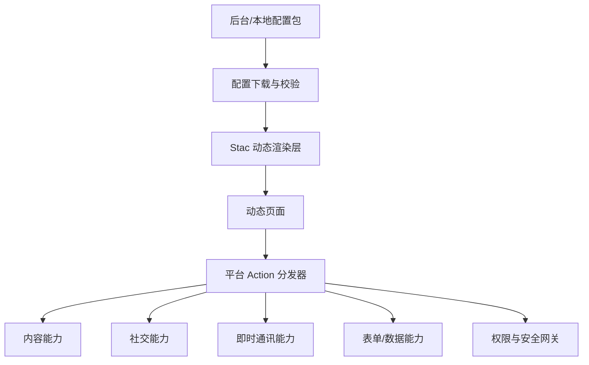

# QuickUI 动态能力平台设计思路

## 1. 背景与目标

当前客户端是一个 Flutter 社交媒体产品，核心能力包括内容展示、用户关系和即时通讯。平台化的目标不是让外部用户直接安装 Flutter 插件或执行任意代码，而是把客户端中已经验证过、安全可控的能力抽象成“配置可调用能力”，再通过后台配置或本地配置包动态生成页面和功能。

短期目标：

- 用 Stac JSON 配置动态生成页面。
- 通过客户端内置 Action 白名单调用社交、内容、IM 等能力。
- 不接服务器也能演示“下载配置 -> 替换 UI -> 查看配置文件”的完整链路。

中期目标：

- 建设配置下载、缓存、签名、灰度和回滚能力。
- 建设后台配置平台，让内部运营或合作方配置页面。
- 将常用业务能力组件化，形成可复用能力市场。

长期目标：

- 形成面向第三方创作者、品牌方、内部业务团队的开放平台。
- 支持插件式业务搭建，但不开放任意代码执行。
- 形成审核、权限、数据、结算和治理体系。

## 2. 总体方向

推荐方向是“固定客户端壳 + Server-Driven UI + 受控平台能力”。



核心原则：

- 页面可以动态，核心能力必须固定在客户端。
- 配置只声明“要做什么”，客户端决定“能不能做、怎么做”。
- 外部用户不能下载执行 Dart、Native、dex、so、framework 等可执行代码。
- 敏感能力必须经过权限白名单、用户确认、审计和可撤销机制。

## 3. 当前 Demo 能做到哪一步

当前 demo 已经完成了最小闭环：

- Flutter 客户端接入 Stac。
- 使用 `assets/stac/*.json` 模拟后台配置文件。
- 点击“下载配置”后，按顺序切换不同 UI 配置并重新渲染。
- 点击“查看配置”后，可以查看当前页面对应的 Stac JSON 层级配置。
- 支持 3 个业务入口：
  - 内容流
  - 专题页
  - 创作者
- 每个入口有 3 套 UI 配置变体。
- 已实现自定义平台 Action：
  - `openChat`
  - `shareArticle`
  - `followAuthor`
  - `submitForm`
  - `requestPermission`
- 已配置 Android GitHub Actions 构建流水线：
  - `flutter pub get`
  - `flutter analyze`
  - `flutter test`
  - `flutter build apk --debug`
  - 上传 APK artifact

当前 demo 还没有做：

- 真实服务器配置下载。
- 配置签名校验。
- 本地持久化缓存和回滚。
- 用户登录态和真实 IM SDK。
- 后台可视化编辑器。
- 第三方开发者入驻、审核和权限申请后台。

## 4. 公司可开放的能力范围

### 4.1 内容能力

可开放：

- 文章列表。
- 文章详情。
- 专题页。
- 推荐内容。
- 作者信息。
- 标签、话题、栏目。
- 图片、视频、富文本展示。
- 内容搜索入口。
- 内容分享卡片。

建议封装组件：

- `post_card`
- `article_view`
- `author_card`
- `topic_chip`
- `media_gallery`
- `recommend_list`

### 4.2 社交能力

可开放：

- 关注作者。
- 点赞。
- 收藏。
- 评论入口。
- 分享入口。
- 举报入口。
- 用户主页跳转。
- 话题页跳转。

需要限制：

- 不允许配置静默关注。
- 不允许配置绕过用户确认进行批量操作。
- 不允许第三方直接读取非公开关系链。

### 4.3 即时通讯能力

可开放：

- 打开单聊。
- 打开群聊。
- 打开客服会话。
- 分享文章卡片到会话。
- 分享活动卡片到会话。
- 邀请用户进入群聊。
- 会话内打开动态页面。

需要限制：

- 不允许配置静默发送消息。
- 不允许第三方读取完整聊天记录。
- 不允许第三方绕过客户端确认发送营销消息。
- 消息卡片模板必须审核。

### 4.4 表单与数据能力

可开放：

- 动态表单。
- 表单校验。
- 表单提交。
- 数据列表。
- 筛选、排序、分页。
- 运营报名。
- 问卷。
- 创作者申请。

建议通过平台网关提交，避免配置直接访问任意第三方接口。

### 4.5 运营活动能力

可开放：

- 活动首页。
- 榜单页。
- 任务页。
- 报名页。
- 奖励说明页。
- 活动分享卡。
- 活动客服入口。

适合优先落地，因为活动页面变化频繁，最能体现动态配置价值。

### 4.6 权限能力

可开放申请，但不能直接开放调用：

- 用户公开资料。
- 内容发布能力。
- 会话卡片能力。
- 分享能力。
- 通知提醒。
- 支付或会员入口。
- 位置、相册、文件等系统权限。

所有权限都应进入 Permission Broker：

- 配置声明需要哪些 scope。
- 后台审核 scope。
- 客户端展示授权说明。
- 用户确认后才执行。
- 后台记录审计日志。

## 5. 不建议开放的能力

不建议开放：

- 任意 Dart 代码执行。
- 动态 Native 插件下载。
- Android dex/JAR/so 动态加载。
- iOS framework/dylib 动态加载。
- 绕过应用商店支付规则的数字商品交易。
- 静默发消息。
- 静默拉群。
- 批量关注。
- 批量私信。
- 读取聊天记录。
- 读取通讯录、相册、定位等敏感数据。

原因：

- 存在应用商店审核风险。
- 存在用户隐私和安全风险。
- 存在平台治理和滥用风险。
- Flutter AOT 模式本身也不适合做任意 Dart 插件动态加载。

## 6. 产品形态设计

### 6.1 客户端

客户端应包含：

- 动态页面容器。
- Stac 渲染器。
- 组件注册表。
- Action 分发器。
- 权限代理。
- 配置缓存。
- 配置回滚。
- 错误兜底页。
- 埋点上报。
- 调试模式下的配置查看器。

当前 demo 已经包含：

- 动态页面容器。
- 本地配置包切换。
- Stac 渲染器。
- 自定义 Action 分发。
- 配置查看页面。

### 6.2 后台平台

后台应包含：

- 应用管理。
- 页面管理。
- 配置编辑器。
- 配置版本管理。
- 真机预览。
- 灰度发布。
- 回滚。
- 权限申请。
- 审核流。
- 数据看板。
- 错误监控。

### 6.3 开发者/运营工作台

工作台应支持：

- 从模板创建页面。
- 拖拽配置组件。
- 配置数据源。
- 配置按钮动作。
- 配置权限申请。
- 预览 JSON。
- 扫码预览。
- 提交审核。
- 查看上线数据。

## 7. 技术架构建议

### 7.1 客户端架构

建议分层：

- UI 层：固定壳、动态容器、原生页面。
- Dynamic Runtime 层：Stac 渲染、组件注册、Action 分发。
- Domain 层：内容、社交、IM、权限用例。
- Data 层：配置仓库、缓存、API、IM SDK、埋点 SDK。

动态配置不应该直接访问 Data 层。它只能通过 Action 分发器调用受控能力。

### 7.2 配置协议

配置建议包含：

```json
{
  "schemaVersion": "1.0",
  "pageId": "feed_home",
  "minClientVersion": "1.0.0",
  "permissions": ["share.card", "chat.open"],
  "stac": {
    "type": "listView",
    "children": []
  }
}
```

当前 demo 直接使用 Stac JSON。产品化后建议外面包一层平台元数据，便于版本、权限、灰度和审核。

### 7.3 Action 协议

配置中的 action 只描述能力调用：

```json
{
  "actionType": "platform",
  "capability": "shareArticle",
  "payload": {
    "articleId": "article_001"
  }
}
```

客户端处理：

1. 判断 action 是否注册。
2. 判断 capability 是否开放。
3. 判断当前应用是否有 scope。
4. 判断是否需要用户确认。
5. 执行原生能力。
6. 上报成功或失败。

## 8. 阶段规划

### 阶段 1：本地 Demo

目标：

- 证明动态页面可行。
- 证明配置可替换 UI。
- 证明配置可以调用客户端能力。

状态：

- 已完成。

### 阶段 2：配置下载与缓存

目标：

- 从服务端下载配置。
- 本地缓存最近可用版本。
- 支持失败回滚。
- 支持配置查看和调试。

建议交付：

- `ConfigRepository`
- `ConfigCache`
- `ConfigValidator`
- `ConfigRollback`

### 阶段 3：后台配置平台

目标：

- 能创建页面。
- 能编辑 JSON。
- 能预览。
- 能发布。
- 能回滚。

建议先做内部运营平台，不急于开放给外部第三方。

### 阶段 4：业务组件市场

目标：

- 把内容、社交、IM、活动组件沉淀为标准组件。
- 让配置人员少写 JSON，多选模板。

建议沉淀：

- 内容流模板。
- 活动页模板。
- 榜单模板。
- 表单模板。
- 作者主页模板。
- 会话分享卡模板。

### 阶段 5：开放平台

目标：

- 支持外部开发者/创作者入驻。
- 支持权限申请。
- 支持审核。
- 支持数据看板。
- 支持下架和风控。

进入这个阶段前必须具备：

- 权限系统。
- 审核系统。
- 风控系统。
- 投诉举报。
- 配置签名。
- 灰度和回滚。
- 完整埋点和日志。

## 9. 风险与治理

### 9.1 技术风险

- Stac JSON 过大导致解析慢。
- 动态页面复杂后调试困难。
- 组件版本兼容问题。
- 配置和客户端版本不匹配。

治理方式：

- schemaVersion。
- minClientVersion。
- 组件版本号。
- 配置体积限制。
- 本地解析错误兜底。

### 9.2 安全风险

- 第三方滥用 IM 能力。
- 第三方诱导用户授权。
- 配置被篡改。
- 外链或内容违规。

治理方式：

- 配置签名。
- 权限白名单。
- 用户确认。
- 审核发布。
- 一键下架。
- 行为审计。

### 9.3 产品风险

- 动态能力过强导致主 App 体验不一致。
- 配置人员缺少工程意识。
- 第三方页面质量参差不齐。

治理方式：

- 标准模板。
- 设计规范。
- 组件约束。
- 发布前预览。
- 质量评分。

## 10. 推荐结论

推荐公司把这个方向定义为“社交客户端能力开放平台”，而不是“Flutter 插件平台”。

第一阶段重点做：

- 动态页面配置。
- 活动/专题/表单场景。
- 内容和分享能力。
- IM 打开会话能力。

第二阶段再做：

- 后台配置平台。
- 配置下载、签名、缓存、回滚。
- 权限申请和审核。

第三阶段才考虑：

- 外部开发者入驻。
- 能力市场。
- 数据看板。
- 商业化和结算。

这条路线能最大化复用现有社交媒体客户端能力，同时避免动态代码、商店审核和安全治理风险。
